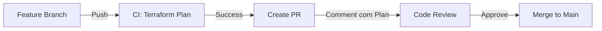
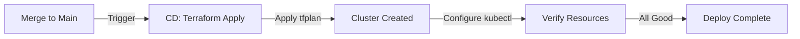
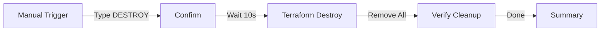

# 🔄 Workflows CI/CD Refatorados - Root Module Unificado

## 📊 Resumo das Mudanças

### Antes (Estrutura Antiga) ❌

```yaml
# 3 jobs separados em cada workflow
jobs:
  plan-cluster:          # Job 1
    working-directory: modules/cluster
    run: terraform plan -var-file=terraform.tfvars
  
  plan-bootstrap-core:   # Job 2
    working-directory: modules/bootstrap-core
    run: terraform plan -var-file=terraform.tfvars
  
  plan-bootstrap-addons: # Job 3
    working-directory: modules/bootstrap-addons
    run: terraform plan -var-file=terraform.tfvars
```

**Problemas:**
- ❌ Módulos não têm mais `backend.tf` → `terraform init` falharia
- ❌ Módulos não têm mais `terraform.tfvars` → comando falharia
- ❌ Providers configurados apenas no root → módulos não funcionam sozinhos
- ❌ 3x mais lento (jobs sequenciais)
- ❌ 3x mais complexo de manter

### Depois (Root Module Unificado) ✅

```yaml
# 1 job único em cada workflow
jobs:
  terraform-plan:        # Job único
    working-directory: ./ (raiz)
    run: terraform plan -var-file=terraform.tfvars
```

**Vantagens:**
- ✅ Roda do diretório raiz onde está o root module
- ✅ Um único `terraform apply` cria tudo
- ✅ Terraform gerencia ordem de execução automaticamente
- ✅ Mais rápido (paralelização interna do Terraform)
- ✅ Mais simples de manter

---

## 📄 Detalhamento dos Workflows

### 1️⃣ CI - Terraform Plan (`ci-infra.yaml`)

**Trigger:**
- Pull Requests para `dev`, `hom`, `main`
- Pushes em branches `feature/**`

**O que faz:**
1. ✅ Checkout do código
2. ✅ Setup do Terraform 1.6.6
3. ✅ Autenticação AWS via OIDC
4. ✅ `terraform fmt -check` (verifica formatação)
5. ✅ `terraform init -upgrade`
6. ✅ `terraform validate`
7. ✅ `terraform plan -var-file=terraform.tfvars`
8. ✅ Comenta no PR com resultado do plan
9. ✅ Faz upload do tfplan como artifact
10. ✅ Adiciona summary no GitHub Actions

**Novidades:**
- 💬 **Comentário automático no PR** com resultado do plan
- 📦 **Upload do tfplan** (pode ser usado no CD)
- 📊 **Summary visual** no GitHub Actions
- ✅ **Validação de formatação** antes do plan

**Exemplo de output no PR:**

```markdown
#### Terraform Format and Style 🖌 success
#### Terraform Initialization ⚙️ success
#### Terraform Validation 🤖 success
#### Terraform Plan 📖 success

<details><summary>Show Plan</summary>

```terraform
Terraform will perform the following actions:
  # module.cluster.aws_eks_cluster.this will be created
  # module.bootstrap_core.helm_release.argocd will be created
  ...
```

</details>

**Pusher**: @seu-usuario
**Action**: pull_request
**Working Directory**: `./` (Root Module)
```

---

### 2️⃣ CD - Terraform Apply (`cd-infra.yaml`)

**Trigger:**
- Push na branch `main`

**O que faz:**
1. ✅ Checkout do código
2. ✅ Setup do Terraform 1.6.6
3. ✅ Setup do kubectl
4. ✅ Autenticação AWS via OIDC
5. ✅ `terraform fmt -check` (warning se falhar)
6. ✅ `terraform init -upgrade`
7. ✅ `terraform validate`
8. ✅ `terraform plan -out=tfplan`
9. ✅ `terraform apply -auto-approve tfplan`
10. ✅ Configura kubectl automaticamente
11. ✅ Aguarda nodes ficarem prontos
12. ✅ Verifica estado do cluster
13. ✅ Verifica addons core
14. ✅ Verifica addons adicionais
15. ✅ Mostra terraform outputs
16. ✅ Summary completo no GitHub Actions

**Novidades:**
- 🔍 **Verificação automática** de nodes, pods, addons
- 📊 **Summary detalhado** com estado de tudo
- 🎯 **Outputs do Terraform** no summary
- ✅ **Environment protection** (production)

**Exemplo de Summary:**

```markdown
## 🎯 Verificação do Cluster

### Nodes
NAME                            STATUS   ROLE    AGE   VERSION
ip-10-0-1-100.ec2.internal      Ready    <none>  5m    v1.29.0
ip-10-0-2-101.ec2.internal      Ready    <none>  5m    v1.29.0

### Pods (todos os namespaces)
NAMESPACE          NAME                                    READY   STATUS
argocd             argocd-server-7d5f6b8c9d-abc12          1/1     Running
external-secrets   external-secrets-6f8c5d7b9-xyz34        1/1     Running
kube-system        aws-load-balancer-controller-5d6-123   1/1     Running

## 📦 Addons Core
...

## 🎉 Deploy Concluído com Sucesso!

✅ **Cluster EKS**: nextime-frame-cluster
✅ **Região**: us-east-1
✅ **Backend State**: s3://nextime-frame-state-bucket/infra-kubernetes/infra.tfstate

📦 **Módulos implantados**:
- ✅ module.cluster - EKS Cluster
- ✅ module.bootstrap_core - IRSA + Addons Core
- ✅ module.bootstrap_addons - Datadog + Secrets
```

---

### 3️⃣ Destroy - Terraform Destroy (`destroy.yaml`)

**Trigger:**
- Manual via `workflow_dispatch`
- Requer confirmação: digitar "DESTROY"

**O que faz:**
1. ✅ Valida confirmação
2. ✅ Checkout do código
3. ✅ Setup do Terraform e kubectl
4. ✅ Autenticação AWS
5. ✅ Configura kubectl (se cluster existe)
6. ✅ Limpa finalizers de namespaces (evita travamento)
7. ✅ `terraform init -upgrade`
8. ✅ `terraform plan -destroy -out=tfplan-destroy`
9. ✅ Aguarda 10 segundos (segurança)
10. ✅ `terraform destroy -auto-approve`
11. ✅ Verifica recursos remanescentes
12. ✅ Lista security groups órfãos
13. ✅ Summary com status da destruição

**Novidades:**
- ⚠️ **Limpeza de finalizers** (evita namespaces travados)
- ⏱️ **Delay de segurança** (10 segundos para cancelar)
- 🔍 **Verificação pós-destruição** (recursos órfãos)
- 📊 **Summary detalhado** do que foi removido

**Proteções:**
- 🔒 **Environment: production** (requer aprovação manual)
- ✋ **Confirmação obrigatória** (digitar DESTROY)
- ⏱️ **Delay de 10 segundos** antes de destruir

---

## 🔄 Fluxo Completo

### Desenvolvimento



### Deploy



### Destroy



---

## 📋 Comparação Antes vs Depois

| Aspecto | Antes (3 Jobs) | Depois (1 Job) |
|---------|----------------|----------------|
| **Jobs por Workflow** | 3 | 1 |
| **Tempo de Execução** | ~45 min (sequencial) | ~30 min (paralelo interno) |
| **Backends** | 3 separados | 1 unificado |
| **Working Directory** | modules/* | ./ (raiz) |
| **Complexity** | Alta | Baixa |
| **Manutenção** | Difícil | Fácil |
| **Rollback** | Complicado | Simples |
| **State Management** | 3 states | 1 state |

---

## 🎯 Variáveis de Ambiente

Todas as pipelines usam:

```yaml
env:
  AWS_REGION: us-east-1
  AWS_ACCOUNT_ID: ${{ secrets.AWS_ACCOUNT_ID }}
  CLUSTER_NAME: nextime-frame-cluster
```

**Secrets necessários:**
- `AWS_ACCOUNT_ID` - ID da conta AWS (configurar no GitHub)

**IAM Role:**
- `arn:aws:iam::${AWS_ACCOUNT_ID}:role/github-action-role`
- Deve ter permissões para:
  - EKS (criar/destruir cluster)
  - EC2 (security groups, nodes)
  - IAM (criar roles IRSA)
  - ELB (load balancers)
  - S3 (backend state)

---

## ✅ Validação Local vs CI/CD

### Local

```bash
# Na raiz do projeto
terraform init
terraform plan -var-file=terraform.tfvars
terraform apply -var-file=terraform.tfvars
```

### CI/CD

```bash
# Exatamente o mesmo!
# Mas com:
# - Autenticação via OIDC
# - Outputs no GitHub Actions
# - Comentários em PRs
# - Verificações automáticas
```

---

## 🚀 Como Usar

### 1. Pull Request (Plan)

```bash
git checkout -b feature/minha-feature
# ... fazer alterações ...
git add .
git commit -m "feat: adiciona nova config"
git push origin feature/minha-feature
# Criar PR → CI roda automaticamente
```

### 2. Deploy (Apply)

```bash
# Após PR aprovado e merged
git checkout main
git pull
# Push para main → CD roda automaticamente
```

### 3. Destroy

1. Ir em: **Actions** > **Destroy Infra AWS**
2. Clicar: **Run workflow**
3. Digitar: `DESTROY`
4. Clicar: **Run workflow**
5. Aguardar confirmação (se environment protection ativo)

---

## 📊 Monitoramento

### GitHub Actions UI

- ✅ Cada step tem logs detalhados
- ✅ Summary visual no final
- ✅ Artifacts (tfplan) disponíveis para download
- ✅ Comentários automáticos em PRs

### Slack/Discord (Opcional)

Adicione notificações:

```yaml
- name: Notificar Slack
  if: always()
  uses: 8398a7/action-slack@v3
  with:
    status: ${{ job.status }}
    text: 'Deploy ${{ job.status }}'
    webhook_url: ${{ secrets.SLACK_WEBHOOK }}
```

---

## 🐛 Troubleshooting

### Erro: "Backend configuration changed"

```bash
# Solução: Re-executar init
terraform init -reconfigure
```

### Erro: "Resource not found" durante destroy

**Causa**: Recursos já foram removidos manualmente.

**Solução**: Remover do state:
```bash
terraform state rm <recurso>
```

### Pipeline travada em "Waiting for approval"

**Causa**: Environment protection ativo.

**Solução**: Ir em Actions → Workflow → Aprovar manualmente.

---

## 🎉 Benefícios da Refatoração

### ✅ Desenvolvimento
- Menos arquivos de configuração
- Código mais limpo
- Fácil de entender
- Fácil de testar localmente

### ✅ CI/CD
- Pipeline mais simples
- Menos jobs
- Mais rápido
- Menos pontos de falha

### ✅ Operação
- Um comando para tudo
- Rollback mais simples
- Estado unificado
- Menos chance de erro

---

## 📚 Próximos Passos

1. ✅ Testar CI em uma feature branch
2. ✅ Fazer PR e verificar comentário automático
3. ✅ Merge e verificar CD
4. ✅ Configurar environment protection
5. ✅ Adicionar notificações (Slack/Discord)
6. ✅ Documentar para o time

---

**Documentação atualizada em:** 2026-02-18  
**Versão:** 2.0 (Root Module Unificado)

